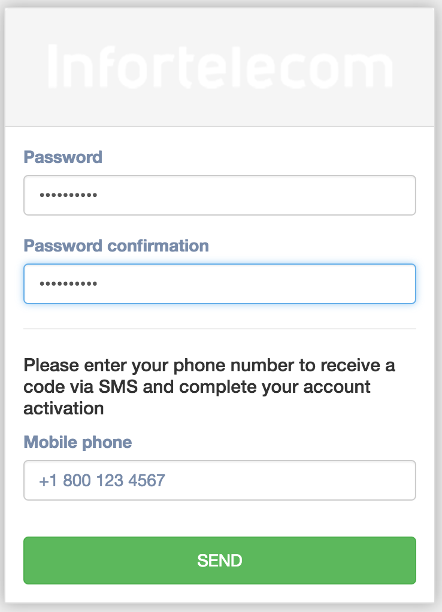
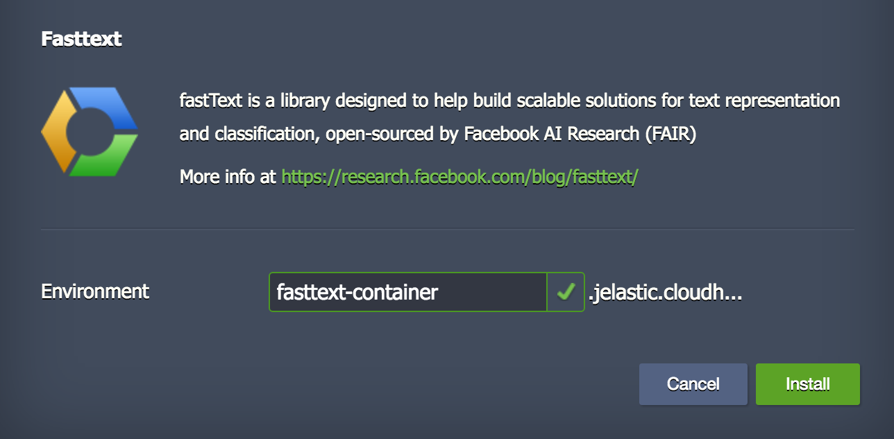
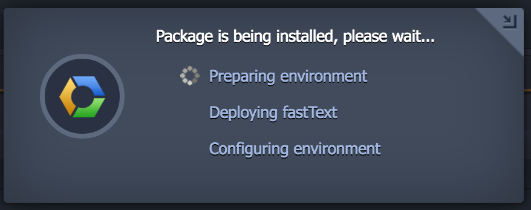
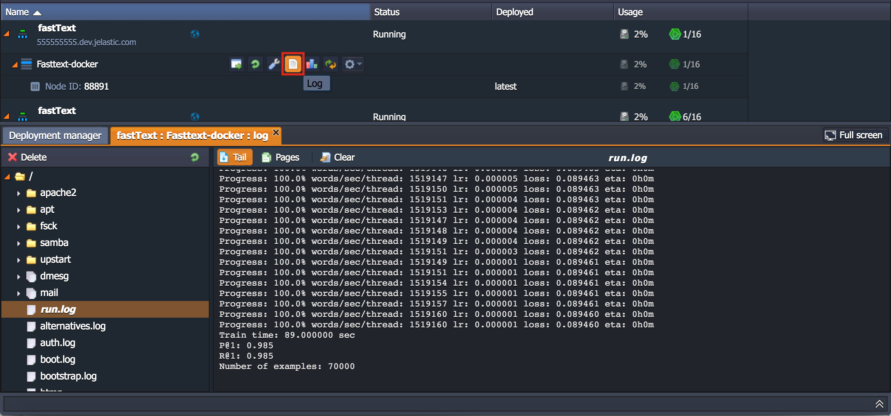

# Deploying fastText-docker on Jelastic

### Signup Verification

Please note: verification process may vary at different <a href="http://jelastic.cloud">Jelastic cloud service providers</a>. 

### Installation Dialog

Press install button.

### Installation Progress 

Wait until it's ready. 

### Checking Logs

Checks the logs https://docs.jelastic.com/view-log-files or jump to SSH console https://docs.jelastic.com/ssh-access 

